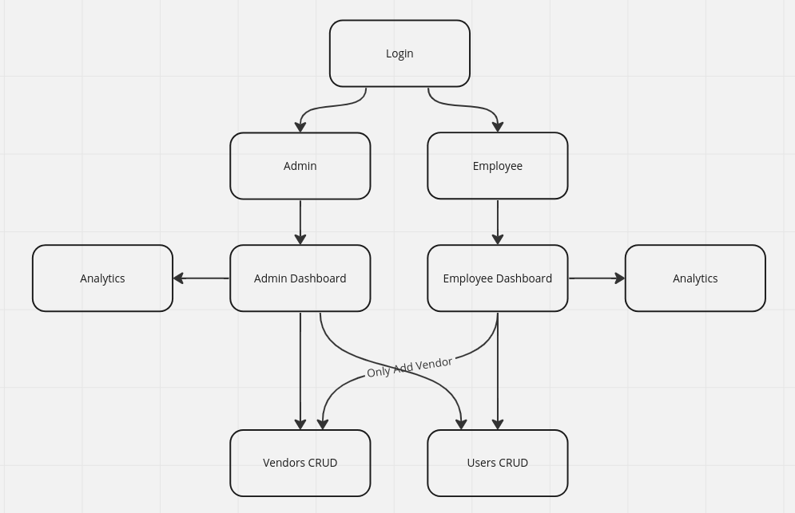
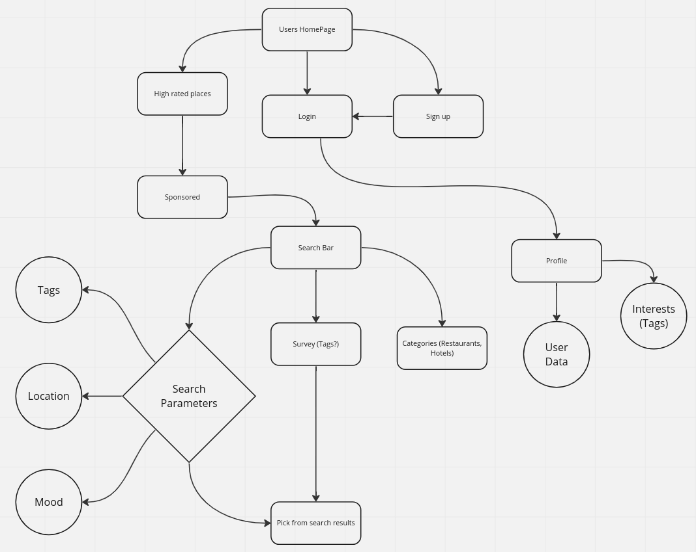

# Project Documentation: Where to Go Website
## Contributors
- [@0xosamaa](https://github.com/0xosamaa)
- [@Youssef-Abdullahx09](https://github.com/Youssef-Abdullahx09)
- [@Muhammed-saber79](https://github.com/Muhammed-saber79)
- [@hassanOsama720](https://github.com/hassanOsama720)
- [@swe-amr-abdelaziz](https://github.com/swe-amr-abdelaziz)
- [@mostafa2080](https://github.com/mostafa2080)

## Table of Contents
1. Introduction
2. Project Structure
3. Functionality Overview
4. Endpoints
5. Usage
6. Project Work Flow

## 1. Introduction
The "Where to Go" website is a Node.js project that suggests places to users based on their current interests and mood. The website caters to three types of users: admin, employees, users, and vendors (place owners or providers). The places can include restaurants, hotels, kids areas, vacation rentals, and parks. This documentation provides an overview of the project structure, functionality, and available endpoints.

## 2. Project Structure
The project follows a client-server architecture, where the server is implemented using Node.js. Here is an overview of the main components and entities in the project:

- **Admin**: The admin user has privileged access and can perform various administrative tasks, such as managing vendors and employees, accepting or rejecting vendors, and viewing website statistics.
- **Employees**: Employees have limited administrative capabilities and can perform CRUD operations on users and vendors. They can also accept or reject vendors and view statistics related to their role in the system.
- **Users**: Users of the website can search for places based on their interests and mood. They can filter and sort the search results based on rating, recency, and location. Users can also write reviews and rate the places if they are logged in.
- **Vendors**: Vendors are the place owners or providers. They can add their places to the website, including images, contact information, description, location, and place tags. Vendors can also view statistics about their places.

## 3. Functionality Overview
The main functionality of the "Where to Go" website includes:

- **User Registration and Login**: Users and vendors can register and log in to the website.
- **Search and Filtering**: Users can search for places based on their interests and mood. They can also filter and sort the search results based on rating, recency, and location.
- **Review and Rating**: Logged-in users can write reviews and rate the places they have visited.
- **Administrative Tasks**: Admin and employees have administrative privileges, such as managing vendors and employees, accepting or rejecting vendors, and viewing website statistics.

## 4. Endpoints
The project provides various endpoints to access different functionalities. Here are the main endpoints along with a brief description:

- **Admin Endpoints**:
  - `/admin/dashboard`: Admin dashboard showing website statistics.
  - `/admin/employees`: CRUD operations for employees.
  - `/admin/vendors`: CRUD operations for vendors.
  - `/admin/users`: CRUD operations for users.
  - `/profile`: Admin profile page.

- **Employee Endpoints**:
  - `/employee/dashboard`: Employee dashboard showing relevant statistics.
  - `/employee/vendors`: CRUD operations for vendors (excluding delete).
  - `/employee/users`: CRUD operations for users.
  - `/profile`: Employee profile page.

- **Vendor Endpoints**:
  - `/vendors/dashboard`: Vendor dashboard showing statistics about their place(s).
  - `/profile`: Vendor profile page.

- **User Endpoints**:
  - `/profile`: User profile page.

- **Other Endpoints**:
  - `/`: Home page of the website.
  - `/explore?parameters`: Endpoint for searching and retrieving filtered results.
  - `/place/:id`: Endpoint to show details of a specific place.
  - `/login`: Login page for both users and vendors.
  - `/signup`: Signup page for both users and vendors.

## 5. Usage
To use the "Where to Go" website, users can navigate to the relevant endpoints to perform specific actions. For example, users can access the home page at the root URL ("/") to start exploring places. They can then search for places using the "/explore" endpoint, providing the required parameters for interests, mood, and location. Users can also create an account or log in using the "/signup" and "/login" endpoints, respectively.

Similarly, vendors can access their dashboard and manage their places using the "/vendors/dashboard" endpoint. Admin and employees can perform their administrative tasks through the corresponding endpoints.

For a detailed understanding of each endpoint's input parameters, responses, and possible actions, please note that this documentation provides a high-level overview of the project structure and functionality. The project is a work in progress, and there may be additions or deletions in the future. It is recommended to review the project's source code and any updated documentation for the most up-to-date and detailed information on the implementation specifics.

## 6. Project Work Flow

| Vendors Dashboard | Admin Dashboard  | Home |
| ------------- | ------------- | ------------- |
|  |  |  

